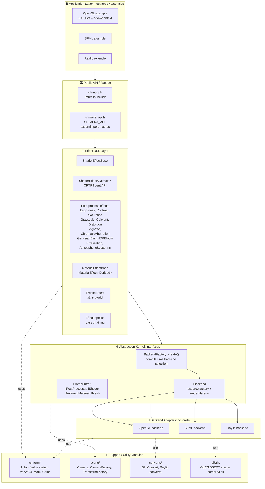
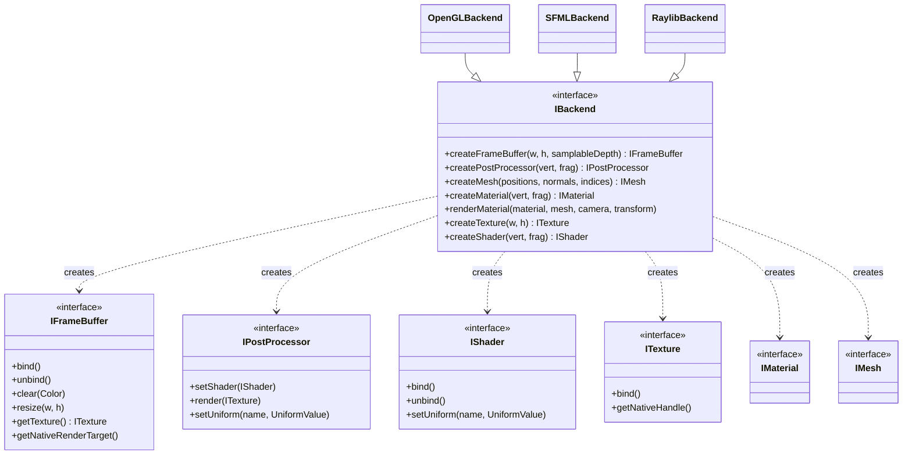
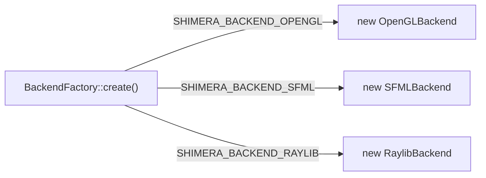
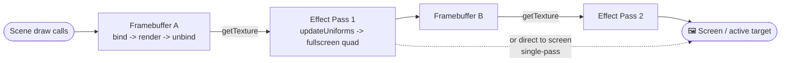
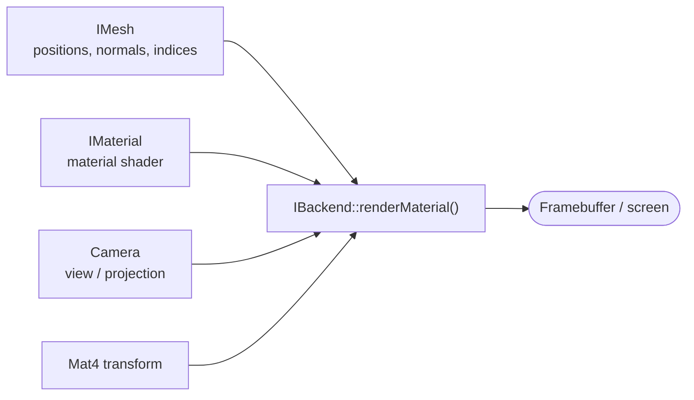
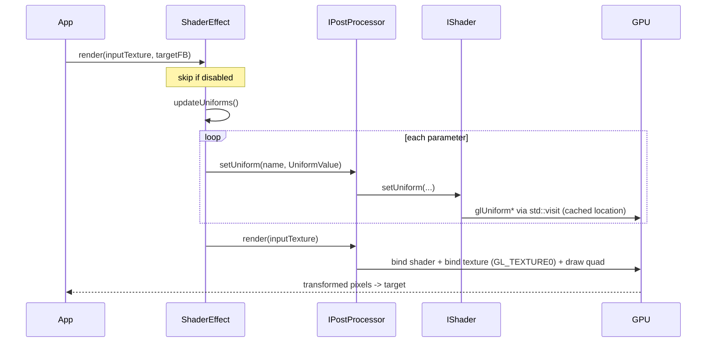
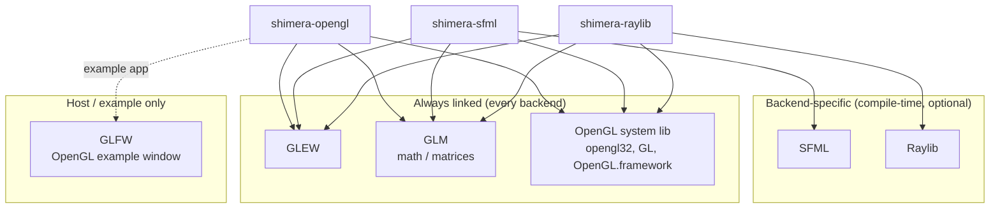

# Shimera Architecture Diagram

A visual overview of Shimera.

Contents:

1. [Interaction layers & core modules](#1-interaction-layers--core-modules)
2. [Backend abstraction (interfaces -> implementations)](#2-backend-abstraction-interfaces--implementations)
3. [Rendering flow](#3-rendering-flow)
4. [External dependencies](#4-external-dependencies)
5. [Module reference table](#5-module-reference-table)

## 1. Interaction layers & core modules

Dependency direction is strictly one-way (top -> bottom): high-level effect orchestration never
depends on a concrete backend. A backend is chosen **at compile time**, not at runtime.

**Layer responsibilities**

| Layer | Role |
|-------|------|
| Application | Owns the window/GL context (GLFW/SFML/Raylib), drives the frame loop, owns Shimera objects. |
| Public API / Facade | Stable entry headers + ABI export macros (`SHIMERA_API`). |
| Effect DSL | Backend-agnostic, fluent effect objects (`.with()`), each wrapping one post-processor. |
| Abstraction Kernel | Pure interfaces + `BackendFactory`, the seam that keeps effects backend-agnostic. |
| Backend Adapters | Concrete OpenGL / SFML / Raylib implementations of every interface. |
| Support / Utility | Typed uniforms & math, scene/camera helpers, glm conversions, GL error/shader helpers. |

## 2. Backend abstraction (interfaces -> implementations)

`IBackend` is a factory: it creates every rendering resource as an interface, so application and
effect code hold only interface pointers. Each concrete backend implements the full set.

**Compile-time selection** (`BackendFactory::create()` + `xmake.lua` defines):

> Each built artifact (`shimera-opengl`, `shimera-sfml`, `shimera-raylib`) is bound
> to exactly one backend path, there is no runtime plugin switching.

## 3. Rendering flow

### 3.1 Post-processing pass chain (ping-pong)

The core pipeline: capture the scene offscreen, then apply fullscreen shader passes, alternating
framebuffers so no pass reads and writes the same target.

### 3.2 3D material path

Alongside post-processing, `IBackend::renderMaterial()` draws lit/shaded geometry (e.g. the
`FresnelEffect`) using a mesh, material shader, camera and transform.

### 3.3 Per-frame control & uniform flow

How an effect pushes CPU-side parameters to the GPU each frame (`std::visit` dispatches the
`UniformValue` variant to the right `glUniform*` call, uniform locations are cached).

## 4. External dependencies

`GLEW`, `GLM` and an OpenGL system library are **always** linked, even the SFML and Raylib
backends run their shader passes through raw OpenGL. Framework libraries are selected per target.

**Per-target dependency matrix**

| Target | GLEW | GLM | OpenGL syslib | Framework | Status |
|--------|:----:|:---:|:-------------:|-----------|--------|
| `shimera-opengl` | ✅ | ✅ | ✅ | - | complete |
| `shimera-sfml` | ✅ | ✅ | ✅ | SFML | complete |
| `shimera-raylib` | ✅ | ✅ | ✅ | Raylib | complete |

> Runtime resources: effects load GLSL from `res/shader/postprocessing/` (and
> `res/shader/material/`) by relative path, so shaders must ship alongside the binary.

## 5. Module reference table

| Module | Location | Purpose |
|--------|----------|---------|
| Public API | `include/shimera.h`, `include/shimera_api.h` | Umbrella include + ABI export macros. |
| Backend interfaces | `include/backend/I*.hpp` | `IBackend`, `IFrameBuffer`, `IPostProcessor`, `IShader`, `ITexture`, `IMaterial`, `IMesh`. |
| Backend factory | `include/backend/BackendFactory.hpp`, `src/backend/BackendFactory.cpp` | Compile-time backend construction. |
| OpenGL backend | `include/backend/opengl/`, `src/backend/opengl/` | Native FBO/texture/shader/mesh/material + fullscreen pass. |
| SFML backend | `include/backend/sfml/`, `src/backend/sfml/` | Wraps `sf::RenderTexture`/`sf::Texture`; passes via OpenGL. |
| Raylib backend | `include/backend/raylib/`, `src/backend/raylib/` | Wraps `RenderTexture2D`; passes via OpenGL; `converts/` for camera/types. |
| Effects | `include/effects/`, `src/effects/` | CRTP `ShaderEffect<Derived>` + 12 post-process effects. |
| Material effects | `include/effects/materials/`, `src/effects/materials/` | `MaterialEffectBase` + `FresnelEffect` (3D). |
| Scene | `include/scene/`, `src/scene/` | `Camera`, `CameraFactory`, `TransformFactory`. |
| Uniforms / math | `include/uniform/` | `UniformValue` variant, `Vec2/3/4`, `Mat4`, `Color`. |
| Converts | `include/converts/`, `src/converts/` | `GlmConvert` and Raylib type conversions. |
| GL utilities | `include/glUtils.h`, `src/glUtils.cpp` | GL error macros + shader compile/link helpers. |

---

### Legend

- **Solid arrow**: direct dependency / data flow.
- **Dashed arrow**: optional / conditional use.
