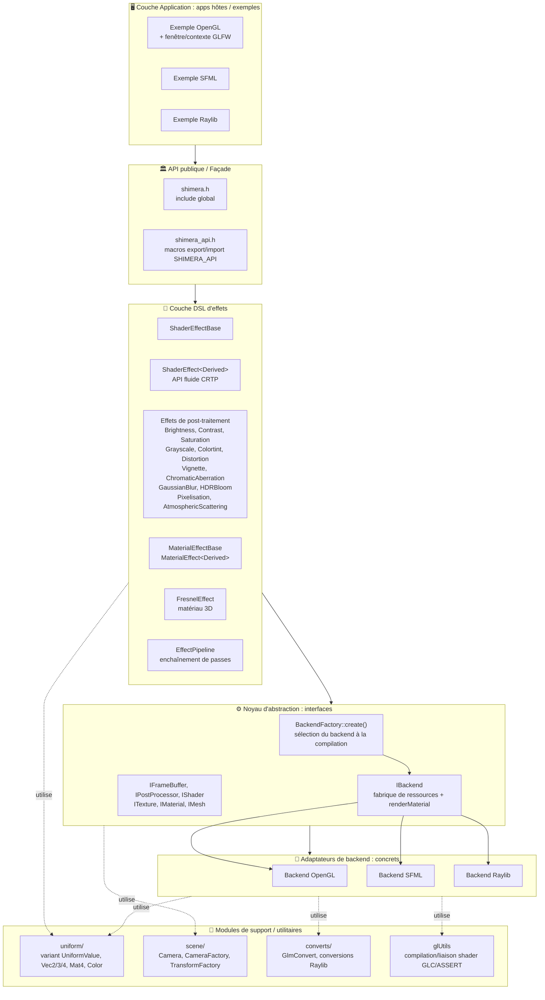
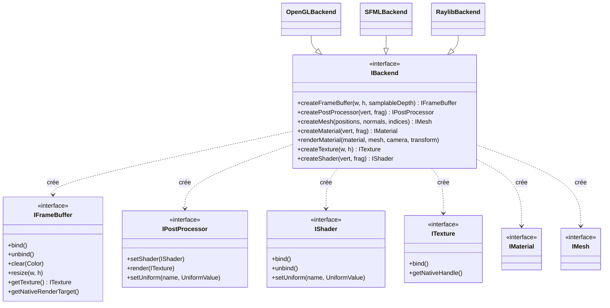
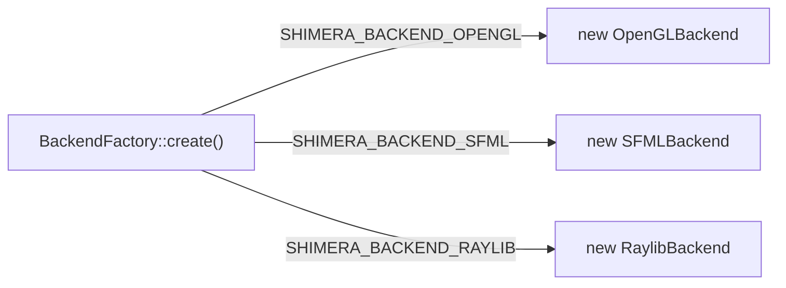
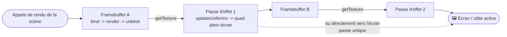
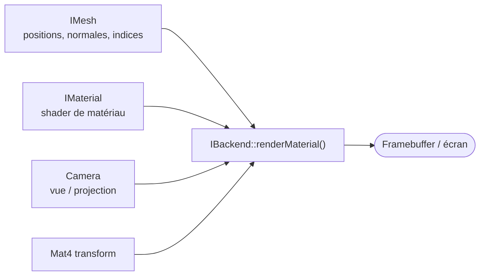
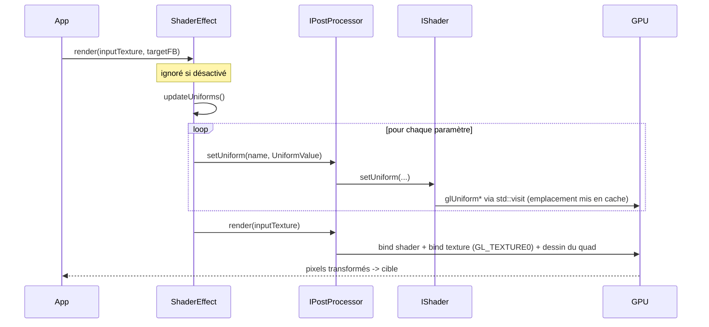
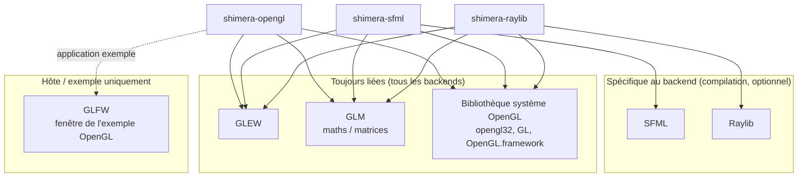

# Diagramme d'architecture de Shimera

Une vue d'ensemble visuelle de Shimera.

Sommaire :

1. [Couches d'interaction & modules principaux](#1-couches-dinteraction--modules-principaux)
2. [Abstraction du backend (interfaces -> implémentations)](#2-abstraction-du-backend-interfaces--implémentations)
3. [Flux de rendu](#3-flux-de-rendu)
4. [Dépendances externes](#4-dépendances-externes)
5. [Table de référence des modules](#5-table-de-référence-des-modules)

## 1. Couches d'interaction & modules principaux

La direction des dépendances est strictement à sens unique (haut -> bas) : l'orchestration des
effets de haut niveau ne dépend jamais d'un backend concret. Un backend est choisi **à la
compilation**, pas à l'exécution.

**Responsabilités des couches**

| Couche | Rôle |
|-------|------|
| Application | Possède la fenêtre/le contexte GL (GLFW/SFML/Raylib), pilote la boucle de rendu, possède les objets Shimera. |
| API publique / Façade | En-têtes d'entrée stables + macros d'export ABI (`SHIMERA_API`). |
| DSL d'effets | Objets d'effet fluides et agnostiques du backend (`.with()`), chacun encapsulant un post-processeur. |
| Noyau d'abstraction | Interfaces pures + `BackendFactory`, la frontière qui garde les effets agnostiques du backend. |
| Adaptateurs de backend | Implémentations concrètes OpenGL / SFML / Raylib de chaque interface. |
| Support / Utilitaires | Uniformes typés & maths, aides scène/caméra, conversions glm, aides d'erreurs GL/shaders. |

## 2. Abstraction du backend (interfaces -> implémentations)

`IBackend` est une fabrique : elle crée chaque ressource de rendu sous forme d'interface, si bien
que le code applicatif et les effets ne manipulent que des pointeurs d'interface. Chaque backend
concret implémente l'ensemble complet.

**Sélection à la compilation** (`BackendFactory::create()` + définitions `xmake.lua`) :

> Chaque artefact compilé (`shimera-opengl`, `shimera-sfml`, `shimera-raylib`) est lié
> à exactement un seul chemin de backend, il n'y a pas de commutation de plugin à l'exécution.

## 3. Flux de rendu

### 3.1 Chaîne de passes de post-traitement (ping-pong)

La pipeline centrale : capturer la scène hors écran, puis appliquer une ou plusieurs passes de
shader plein écran, en alternant les framebuffers pour qu'aucune passe ne lise et n'écrive la
même cible.

### 3.2 Chemin des matériaux 3D

En complément du post-traitement, `IBackend::renderMaterial()` dessine une géométrie
ombrée/éclairée (par ex. `FresnelEffect`) à partir d'un mesh, d'un shader de matériau,
d'une caméra et d'une transformation.

### 3.3 Flux de contrôle et d'uniformes par image

Comment un effet transmet ses paramètres CPU au GPU à chaque image (`std::visit` distribue le
`UniformValue` vers le bon appel `glUniform*`, les emplacements d'uniformes sont mis en cache).

## 4. Dépendances externes

`GLEW`, `GLM` et une bibliothèque système OpenGL sont **toujours** liées, même les backends SFML
et Raylib exécutent leurs passes de shader via OpenGL brut. Les bibliothèques de framework sont
sélectionnées par cible.

**Matrice de dépendances par cible**

| Cible | GLEW | GLM | Bibliothèque système OpenGL | Framework | Statut |
|--------|:----:|:---:|:-------------:|-----------|--------|
| `shimera-opengl` | ✅ | ✅ | ✅ | - | complet |
| `shimera-sfml` | ✅ | ✅ | ✅ | SFML | complet |
| `shimera-raylib` | ✅ | ✅ | ✅ | Raylib | complet |

> Ressources à l'exécution : les effets chargent le GLSL depuis `res/shader/postprocessing/` (et
> `res/shader/material/`) par chemin relatif, les shaders doivent donc être livrés avec le binaire.

## 5. Table de référence des modules

| Module | Emplacement | Objectif |
|--------|----------|---------|
| API publique | `include/shimera.h`, `include/shimera_api.h` | Include global + macros d'export ABI. |
| Interfaces de backend | `include/backend/I*.hpp` | `IBackend`, `IFrameBuffer`, `IPostProcessor`, `IShader`, `ITexture`, `IMaterial`, `IMesh`. |
| Fabrique de backend | `include/backend/BackendFactory.hpp`, `src/backend/BackendFactory.cpp` | Construction du backend à la compilation. |
| Backend OpenGL | `include/backend/opengl/`, `src/backend/opengl/` | FBO/texture/shader/mesh/matériau natifs + passe plein écran. |
| Backend SFML | `include/backend/sfml/`, `src/backend/sfml/` | Encapsule `sf::RenderTexture`/`sf::Texture` ; passes via OpenGL. |
| Backend Raylib | `include/backend/raylib/`, `src/backend/raylib/` | Encapsule `RenderTexture2D` ; passes via OpenGL ; `converts/` pour caméra/types. |
| Effets | `include/effects/`, `src/effects/` | `ShaderEffect<Derived>` CRTP + 12 effets de post-traitement. |
| Effets de matériau | `include/effects/materials/`, `src/effects/materials/` | `MaterialEffectBase` + `FresnelEffect` (3D). |
| Scène | `include/scene/`, `src/scene/` | `Camera`, `CameraFactory`, `TransformFactory`. |
| Uniformes / maths | `include/uniform/` | Variant `UniformValue`, `Vec2/3/4`, `Mat4`, `Color`. |
| Conversions | `include/converts/`, `src/converts/` | `GlmConvert` et conversions de types Raylib. |
| Utilitaires GL | `include/glUtils.h`, `src/glUtils.cpp` | Macros d'erreurs GL + aides de compilation/liaison de shaders. |

---

### Légende

- **Flèche pleine** : dépendance directe / flux de données.
- **Flèche pointillée** : utilisation optionnelle / conditionnelle.
